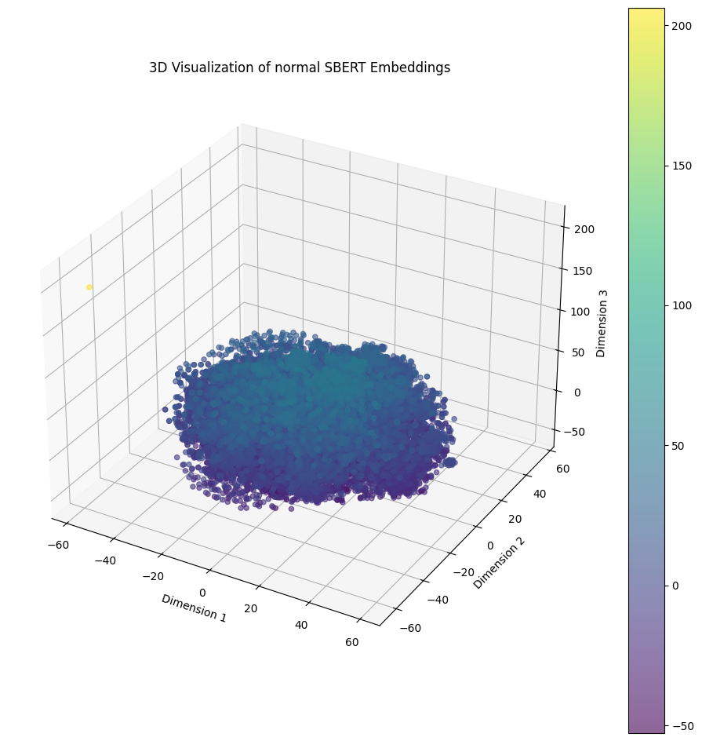

# Relevance Search w/ Embeddings

- [Relevance Search w/ Embeddings](#relevance-search-w-embeddings)
  - [1. Dataset \& embeddings](#1-dataset--embeddings)
  - [2. Visualization](#2-visualization)
  - [3. Testing](#3-testing)
    - [Test that yields 10 results](#test-that-yields-10-results)
    - [Test that yields less than 10 results](#test-that-yields-less-than-10-results)
    - [Non-obvious](#non-obvious)

## 1. Dataset & embeddings

The dataset I used for this project is custom-generated from BlueSky posts happening in real-time. To generate it, run the `download_posts.py` script. It will output a `posts.csv` file with a `cid` and a `text` column.

To generate embeddings, [sBERT](https://sbert.net/) was used as a base. I then further enhanced it by training a denoising autoencoder on the embeddings. This process helps to improve the quality of the embeddings by reducing noise and capturing more meaningful patterns in the data. The enhanced embeddings are then used for relevance search.

```mermaid
flowchart TB
    subgraph Input
        text[Text Documents]
    end

    subgraph SBERT["Sentence-BERT Encoder"]
        sbert[/"paraphrase-multilingual-MiniLM-L12-v2"/]
        dim1["384-dimensional embeddings"]
    end

    subgraph DAE["Denoising Autoencoder"]
        direction TB
        subgraph encoder["Encoder"]
            e1["Linear(384→256) + ReLU"]
            e2["Linear(256→128) + ReLU"]
            e3["Linear(128→64) + ReLU"]
        end
        
        subgraph decoder["Decoder (Training Only)"]
            d1["Linear(64→128) + ReLU"]
            d2["Linear(128→256) + ReLU"]
            d3["Linear(256→384) + Tanh"]
        end
        
        noise["Add Gaussian Noise (During Training)"]
    end

    subgraph Output
        final["64-dimensional enhanced embeddings"]
    end

    text --> sbert
    sbert --> dim1
    dim1 --> noise
    noise --> e1
    e1 --> e2
    e2 --> e3
    e3 --> final
    
    e3 --> d1
    d1 --> d2
    d2 --> d3
    d3 --> |"Compare with original for training"|dim1

    style Input fill:#e1f5fe
    style SBERT fill:#fff3e0
    style DAE fill:#f3e5f5
    style Output fill:#e8f5e9
```



A denoising autoencoder receives SBERT embeddings as input. The model adds noise to these embeddings during training. The encoder transforms noisy embeddings from 384 dimensions to 64 dimensions, while the decoder reconstructs the original input. The noise injection forces the encoder to extract important meaning from the text. The dimension reduction removes redundant information from the pre-trained model.

$L = \frac{1}{N} \sum_{i=1}^{N} (x_i - D(E(x_i + \varepsilon)))^2$

## 2. Visualization

<div style="display: flex; justify-content: space-around;">
  
  
</div>

The left figure shows the distribution of original SBERT embeddings in three dimensions. There are no apparent clusters, just a big blob. The embedding space lacks clear separation between different semantic regions. The right figure presents the enhanced embeddings after autoencoder processing. The separation between regions show that the autoencoder learned to amplify semantic differences in the original embeddings.

## 3. Testing

### Test that yields 10 results

Searching for "trump" returned a bunch of US-election-related posts:

```
Post: @AFP: Here is the state of play at 1:16 GMT in the US presidential election: Donald Trump accumulates a total of 90 electoral votes, against 27 for Democratic Vice President Kamala Harris #AFP #ElectionDay https://t.co/Xge0suAJzN
Similarity: 0.9763736724853516

Post: Trump ficou com o bicho
Similarity: 0.9746522903442383

Post: MAGA Meltdown as Trump Begs Men: Get Off the Couch and Vote 
www.thedailybeast.com/panicked-tru... 

#Politics #USPolitics #DonaldTrump #MAGAMorons #GOP #Republicans #Election2024 #2024Election
Similarity: 0.9736570715904236

Post: Ai mds o Trump tá ganhando
Similarity: 0.9731288552284241

Post: esse querido correu para o Trump poder andar
Similarity: 0.9717773199081421

Post: 🟦 Kamala 27 x 106 Trump 🟥

🟥 Arkansas (7)

#AoVivo: Acompanhe a apuração das presidenciais americanas na ABC News
Similarity: 0.9707875847816467

Post: 大統領選ですね。
Similarity: 0.9701293110847473

Post: Fuck Trump.
Similarity: 0.9699349403381348

Post: 🟦 Harris 27 x 106 Trump 🟥

🟥 Arkansas (7)

#AoVivo: Siga apuração das presidenciais americanas na ABC News
Similarity: 0.9698759317398071

Post: David Corn on Lawrence O'Donnell: "Mitt Romney, a dead horse candidate." #fb
Similarity: 0.9695233702659607
```

### Test that yields less than 10 results

Searching for "league of legends" yielded no results, as no posts with > 0.97 similarity were collected during the generation of the dataset.

### Non-obvious

Before I added the >0.97 treshold, it was curious to find that posts in different languages were still found by the search, due to the multi-language nature of the sBERT embedding model chosen.

When searching for "don't vote for trump", for example, I was able to find a post about trump in Korean, even though it doesn't have any words written in english.

```
Post: 우리나라 사람들에게 미국 대선 투표권을 줬다면 트럼프에게도 상당한 표가 갔을 것 같다.
그러니 윤석열 같은 사람이 대통령이라고 저러고 있겠지.
Similarity: 0.9569224715232849
```